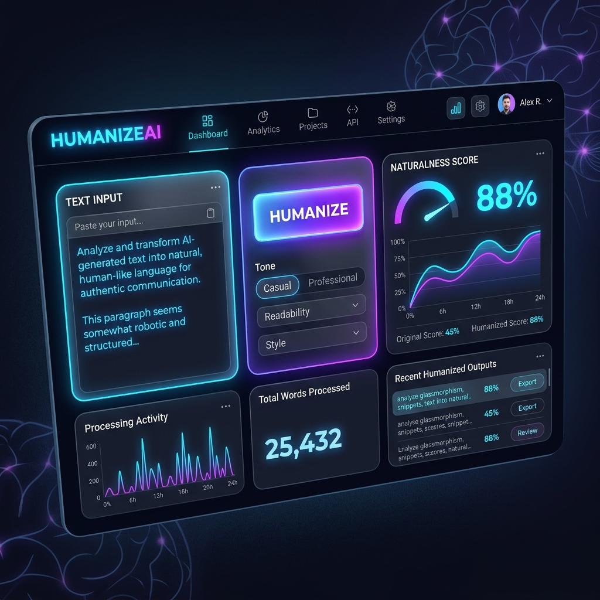

# ✨ HumanizeAI

[](https://huumanize.vercel.app)
[](https://opensource.org/licenses/MIT)
[](https://openrouter.ai/)

**HumanizeAI** is a premium, high-performance web application designed to transform robotic AI-generated text into natural, warm, and genuinely human writing. Built with a focus on speed, aesthetics, and privacy.



## 🚀 Key Features

-   **8 Writing Tones**: Choose between Casual, Professional, Friendly, Academic, Storytelling, Gen Z, Persuasive, and Empathetic.
-   **Naturalness Score**: Instant visualization of how human your text sounds.
-   **AI Detail Stripping**: Automatically removes overused AI phrases and "tells".
-   **Instant Privacy**: No signup required; session history is stored locally.
-   **Dark Mode Mastery**: A stunning, glassmorphic UI built for modern developers.

## 🛠️ Tech Stack

-   **Frontend**: Vanilla HTML5, CSS3 (Glassmorphism), and Modern Javascript.
-   **Backend**: Vercel Serverless Functions.
-   **AI Engine**: Groq API (Llama 3.3 70B Versatile).
-   **Database**: Supabase (for persistent humanization logs).
-   **Monetization**: Integrated Adsterra High-Performance Scripts.


## 📦 Getting Started

### 1. Prerequisites
- [Node.js](https://nodejs.org/) installed.
- [Vercel CLI](https://vercel.com/cli) (optional but recommended).

### 2. Environment Variables
Create a `.env.local` file in the root directory:
```env
OPENROUTER_API_KEY=your_key_here
SUPABASE_URL=your_supabase_url
SUPABASE_SERVICE_KEY=your_supabase_key
```

### 3. Running Locally
```bash
# Using Vercel CLI
vercel dev

# Or simple local server
npx live-server
```

## 🎯 SEO & Performance
Optimized for search engines with:
-   **JSON-LD Schema**: Structured data for WebApplication and FAQ.
-   **Semantic HTML**: Proper hierarchy with accessibility in mind.
-   **Meta Tags**: Comprehensive OG and Twitter card support.

## 📄 License
Distributed under the MIT License. See `LICENSE` for more information.

---
Built with ❤️ for a more human web.
